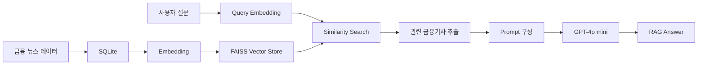

# 📈 RAG Financial Analysis

> **RAG 기술을 활용한 금융정보 분석 API**  
> 최신 금융정보를 검색하고, 관련 문서를 LLM의 Context로 활용하여  
> 보다 정확하고 최신성이 높은 답변을 제공하는 금융정보 질의응답 시스템

<br>

## 🔎 Project Overview

기존 LLM은 학습 시점 이후의 **최신 정보 반영에 한계**가 있고,  
질문과 관련성이 낮은 내용을 생성하는 **Hallucination 문제**가 발생할 수 있습니다.

본 프로젝트에서는 이를 보완하기 위해 **RAG(Retrieval-Augmented Generation)** 구조를 적용했습니다.

사용자의 질문과 관련성이 높은 금융기사를 Vector DB에서 검색하고,  
검색된 문서를 LLM의 Context로 전달하여 **최신 금융정보를 기반으로 답변을 생성**하도록 구현했습니다.

<br>

## 📌 Project Info

| 구분 | 내용 |
| --- | --- |
| 프로젝트명 | RAG 기술을 활용한 금융정보 분석 API |
| 팀명 | LLM의 정상화 |
| 기간 | 2024.09.02 ~ 2025.04.29 |
| 인원 | 4명 |
| 분야 | RAG · LLM · NLP · Vector Search |

<br>

## ⚙️ How It Works



### RAG Process

`금융 뉴스 데이터`
→ `Embedding`
→ `FAISS 저장`
→ `사용자 질문 벡터화`
→ `유사도 검색`
→ `관련 문서 추출`
→ `Prompt 생성`
→ `LLM Answer`

<br>

## 👩‍💻 My Contribution

### 01. LangChain 기반 RAG 모델 구현

- 금융 뉴스 데이터를 활용한 RAG Pipeline 구현
- 사용자 질문을 Vector로 변환하여 기사 데이터와 유사도 검색
- 검색 결과를 LLM Context로 전달하여 답변을 생성하는 구조 구현
- FAISS 기반 Vector Store 구축 및 검색 로직 구성

### 02. 금융 뉴스 Embedding & Vector DB 구축

- SQLite에 저장된 금융 뉴스 데이터 Embedding
- Embedding 결과를 FAISS Vector Store에 저장
- 사용자 질문과 기사 간 Vector Similarity 비교
- 관련도가 높은 문서를 추출하여 RAG Context로 활용

### 03. Embedding Model 비교

RAG 검색 성능을 확인하기 위해 다양한 Embedding Model을 비교했습니다.

주요 비교 모델

- `sentence-transformers/paraphrase-MPNet-base-v2`
- `text-embedding-3-small`
- `text-embedding-ada-002`

각 모델별 검색 결과와 질문 관련성을 비교한 결과,  
**검색 성능과 비용을 고려하여 `text-embedding-3-small`을 최종 적용했습니다.**

### 04. 검색 결과 개선

단순히 **Similarity Score가 높다고 실제 질문과 관련성이 높은 것은 아니라는 점**을 확인했습니다.

이에 따라

- 검색 결과의 실제 질문 관련성 확인
- 중복 문서 제거
- 검색 문서 수 조정
- 기사 데이터 처리 방식 비교

등을 통해 검색 결과를 개선했습니다.

최종적으로

```text
Similarity Search
        ↓
상위 7개 기사 검색
        ↓
중복 문서 제거
        ↓
최종 5개 기사 선정
        ↓
LLM Context 전달
```

구조로 구성했습니다.

### 05. Prompt Engineering

검색된 문서가 실제 답변에 적절하게 활용될 수 있도록 Prompt를 개선했습니다.

Prompt 구성 요소

- Role 지정
- 응답 기준 설정
- 관련성 Filtering
- 답변 방향 설정
- 현재 날짜 반영
- 검색된 Context 삽입
- 사용자 질문 삽입

특히 검색된 문서가 질문과 관련이 없는 경우  
무리하게 답변을 생성하지 않도록 **관련성 Filtering 조건을 적용했습니다.**

<br>

## 🧪 Experiment

### 문장 단위 Embedding 실험

기사 전체를 그대로 Embedding하는 방식 외에도  
기사 본문을 문장 단위로 분리하여 Embedding하는 방식을 실험했습니다.

그러나 문장을 지나치게 세분화할 경우

- 기사 전체 Context 손실
- 검색 결과 분산
- 질문과 실제 문서의 관련성 저하

문제가 발생할 수 있음을 확인했습니다.

이를 통해 단순히 Vector Similarity 수치만 높이는 것보다  
**검색된 문서가 실제 질문의 의도와 얼마나 관련되어 있는지 검증하는 과정이 중요하다는 점을 확인했습니다.**

<br>

## 🛠 Tech Stack

### AI / RAG


- Python
- LangChain
- OpenAI API
- GPT-4o mini
- text-embedding-3-small
- FAISS

### Backend / Data


- SQLite
- Flask
- Nginx

### Collaboration


- Git
- GitHub

<br>

## 💡 What I Learned

처음 접한 RAG와 Embedding 기술을 직접 구현하며  
**기능이 정상적으로 동작하는 것과 좋은 검색 결과를 만드는 것은 다르다**는 점을 배웠습니다.

Embedding Model과 데이터 처리 방식을 변경하며 결과를 비교하는 과정에서  
Similarity Score만 확인하기보다 실제 질문과 검색 문서의 관련성을 직접 검증했습니다.

예상과 다른 결과가 발생했을 때 원인을 분석하고,  
다른 방식을 적용한 뒤 다시 결과를 비교하는 과정을 반복하면서  
새로운 기술을 **직접 실험하고 검증하며 개선하는 방식**으로 익힐 수 있었습니다.

<br>

---

### 👥 Team LLM의 정상화

**RAG 기술을 활용한 금융정보 분석 API**

`2024.09 ~ 2025.04`
